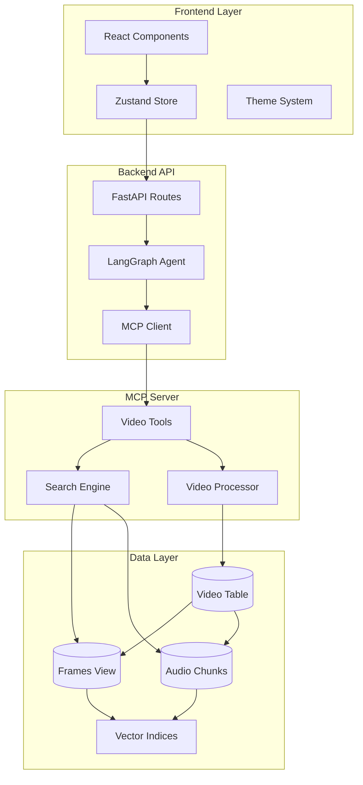

# 🎬 Multimodal RAG Agent

Intelligent Video Understanding with AI-Powered Search &amp; Retrieval

# 🎬 Multimodal RAG Agent

**Intelligent Video Understanding with AI-Powered Search & Retrieval**

[](https://nextjs.org/)
[](https://fastapi.tiangolo.com/)
[](https://www.python.org/)
[](https://www.typescriptlang.org/)
[](https://www.docker.com/)
[](LICENSE)

> **Search videos using natural language, extract clips with AI, and ask questions about your video content — all powered by advanced multimodal RAG techniques.**

---

## 📺 Demo

### Watch the Multimodal RAG Agent in Action

[](https://www.youtube.com/watch?v=YOUR_VIDEO_ID)

---

## ⚡ Key Features

### 🎥 Video Intelligence

- **🎬 Smart Frame Analysis** - Automatically extract and caption key frames using vision models
- **🎤 Audio Transcription** - Convert speech to searchable text with Whisper/Groq
- **✂️ Precise Clip Extraction** - Retrieve exact video moments based on queries
- **🔍 Multi-Modal Search** - Search by text, image, or natural language

### 🤖 AI Agent System

- **🧠 Intelligent Routing** - LangGraph-powered decision making
- **🛠️ Tool Orchestration** - Automatic selection of the right tools
- **💾 Memory Management** - Conversation summarization for long contexts
- **🔄 Fail-Safe Design** - Graceful error handling with retries

### 📊 Data Management

- **🗄️ Pixeltable Database** - Structured storage for multimodal data
- **🔢 Vector Search** - CLIP & Sentence Transformer embeddings
- **📋 Media Registry** - Centralized tracking of all videos
- **⏱️ Background Processing** - Async task execution with status tracking

### 🎨 Modern Interface

- **📱 Responsive Design** - Works on desktop, tablet, and mobile
- **🌓 Dark/Light Theme** - Seamless theme switching
- **📁 Media Gallery** - Organized view of all your content
- **🎯 Video Selection** - Target specific videos for search

---

## 🏗️ System Architecture



### 🔧 Technology Stack

| Layer              | Technologies                                                       |
| ------------------ | ------------------------------------------------------------------ |
| **Frontend**       | Next.js, TypeScript, Tailwind CSS, Zustand                         |
| **Backend**        | FastAPI, Python, LangChain, LangGraph                              |
| **MCP Server**     | FastMCP, Pixeltable, PyAV, MoviePy                                 |
| **AI/ML**          | Groq (Llama 4, Whisper), HuggingFace (CLIP, Sentence Transformers) |
| **Infrastructure** | Docker, Docker Compose                                             |

---

## 🚀 Quick Start

### Prerequisites

Before starting, ensure you have:

- ✅ Docker
- ✅ Groq API Key (get it free at console.groq.com)

### One-Command Setup

```bash
# Clone and start everything
git clone
cd multimodal-rag-agent

docker compose up --build -d

or

make start-multimodal-rag
```

**That's it!** 🎉 Open http://localhost:3000

---

### 🔑 Getting Your Groq API Key

1. Visit [console.groq.com](https://console.groq.com)
2. Sign up (it's free!)
3. Navigate to API Keys
4. Create a new API key
5. Copy and paste into `.env` file

```env
GROQ_API_KEY=gsk_your_key_here
```

---

### 📋 Service URLs

| Service         | URL                        | Description                   |
| --------------- | -------------------------- | ----------------------------- |
| **Frontend**    | http://localhost:3000      | Main web interface            |
| **Backend API** | http://localhost:8080      | REST API                      |
| **API Docs**    | http://localhost:8080/docs | Interactive API documentation |
| **MCP Server**  | http://localhost:9090      | Video processing server       |

---

### ⚙️ Environment Variables

Create a `.env` file in the root directory of each project:

```env
# Required
GROQ_API_KEY=your_groq_api_key_here

For Next.js UI:
NEXT_PUBLIC_API_URL=http://localhost:8080
NEXT_PUBLIC_API_MEDIA_URL=http://localhost:8080/media
```

For detailed configuration, see configuration files `config.py` in `multimodal-api` and `multimodal-mcp`.

---

## 💡 Usage Examples

### 📤 Upload and Process a Video

**Steps:**

1. Click **"Media Gallery"** in sidebar
2. Select **"Uploaded Videos"** tab
3. Click **"+ Add Video"** button
4. Choose your video file
5. Wait for processing (shows progress)

**What happens:**

- 🎬 Frames extracted & captioned
- 🎤 Audio transcribed
- 🔢 Embeddings generated
- ✅ Ready for search!

---

### 🔍 Search Examples

#### 💬 Text-Based Search

**Query:**

```
"Find the part where they discuss machine learning algorithms"
```

**Result:**

- 🎬 AI extracts relevant clip
- 📍 Shows exact timestamp
- 🎥 Plays in media viewer

**Use for:**

- Finding specific topics
- Locating quotes
- Scene discovery

---

#### 🖼️ Image-Based Search

**Query:**

```
[Upload an image]
"Find similar scenes"
```

**Result:**

- 🔍 Visual similarity search
- 🎬 Matching video segments
- 📊 Similarity scores

**Use for:**

- Finding visual matches
- Scene recognition
- Object tracking

---

### 🎯 Targeted Search (New!)

**Without Selection:**

- 🔍 Searching all videos
- ⏱️ May take longer
- 📊 More results

**With Selection:**

- ✅ videos selected
- ⚡ Fast & focused search
- 🎯 Relevant results only

**How to use:**

1. Open "Uploaded Videos"
2. Check ☑️ desired videos
3. "Search Target" shows count
4. Ask your question!

---

### 💬 Question Answering

**Try these queries:**

```bash
❓ "Find me the clip of the robot?"
❓ "Give me the clip where the character is saying hello."
❓ "Is there a science theory discussed in any of the videos?"
```

**AI will:**

- 📖 Analyze captions & transcripts
- 🎯 Extract relevant information
- 💡 Provide concise answers

---

## 📚 Documentation

### 🗂️ Project Structure

```
multimodal-rag-agent/
│
├── 🎨 multimodal-agent-ui/        # Next.js Frontend
│   ├── app/
│   │   ├── components/
│   │   │   ├── features/           # Feature components
│   │   │   │   ├── Chat.tsx
│   │   │   │   ├── ChatInput.tsx
│   │   │   │   ├── MediaGallery.tsx
│   │   │   │   └── VideoSelector.tsx
│   │   │   ├── layouts/            # Layout components
│   │   │   │   ├── Sidebar.tsx
│   │   │   │   └── Header.tsx
│   │   │   └── ui/                 # UI components
│   │   ├── lib/
│   │   │   ├── store/              # Zustand store
│   │   │   ├── hooks/              # Custom hooks
│   │   │   └── api/                # API client
│   │   └── globals.css             # Dual theme styles
│   └── Dockerfile
│
├── ⚡ multimodal-api/              # FastAPI Backend
│   ├── src/multimodal_api/
│   │   ├── agent/                  # LangGraph Agent
│   │   │   ├── nodes/              # Agent nodes
│   │   │   ├── graph.py            # Workflow
│   │   │   └── mcp_client.py       # MCP wrapper
│   │   ├── router/                 # API endpoints
│   │   │   ├── chat.py
│   │   │   ├── media_files.py
│   │   │   └── process_video.py
│   │   └── utils/                  # Utilities
│   └── Dockerfile
│
├── 🛠️ multimodal-mcp/              # MCP Server
│   ├── src/multimodal_mcp/
│   │   ├── video/
│   │   │   ├── ingestion/          # Video processing
│   │   │   ├── clip_extractor.py   # Clip extraction
│   │   │   └── search_video.py     # Search engine
│   │   ├── tools.py                # MCP tools
│   │   └── server.py               # FastMCP server
│   └── Dockerfile
│
├── 📁 shared_media/                 # Shared storage
│   ├── images/
│   └── videos/
│       ├── uploads/
│       └── ai_responses/
│
├── 🐳 docker-compose.yml
└── 📄 README.md
```

---

## ⚙️ Configuration

### Model Provider Settings

#### Groq (Recommended - Free Tier Available)

```env
MODEL_PROVIDER=groq
GROQ_API_KEY=your_key_here

# Models used:
# - Vision: meta-llama/llama-4-scout-17b-16e-instruct
# - Transcription: whisper-large-v3
# - Embeddings: all-MiniLM-L6-v2 (HuggingFace)
```

**Advantages:**

- ⚡ Fast inference (< 1s)
- 💰 Cost-effective
- 🆓 Generous free tier
- 🔥 Latest Llama 4 models

---

#### OpenAI (Alternative)

```env
MODEL_PROVIDER=openai
OPENAI_API_KEY=your_key_here

# Models used:
# - Vision: gpt-4o-mini
# - Transcription: whisper-1
# - Embeddings: text-embedding-3-small
```

**Advantages:**

- 🎯 Higher quality
- 📊 GPT-4 Vision
- 🌐 Proven reliability

---

### Video Processing Tuning

```env
# Frame Extraction
NUM_FRAMES=30                    # More = better search, slower processing
IMAGE_RESIZE_WIDTH=1024          # Lower = faster, less accurate
IMAGE_RESIZE_HEIGHT=768

# Audio Processing
AUDIO_CHUNK_DURATION_SEC=10      # Chunk size for transcription
AUDIO_OVERLAP_SEC=2              # Overlap between chunks

# Search Quality
SPEECH_SIMILARITY_SEARCH_TOP_K=1 # Results per search
CAPTION_SIMILARITY_SEARCH_TOP_K=1
IMAGE_SIMILARITY_SEARCH_TOP_K=1
```

**Performance Tips:**

| Setting              | Fast | Balanced | Quality |
| -------------------- | ---- | -------- | ------- |
| `NUM_FRAMES`         | 15   | 30       | 60      |
| `IMAGE_RESIZE_WIDTH` | 512  | 1024     | 1920    |

---

### Agent Behavior

```env
# Memory Management
MAX_TOKENS_BEFORE_SUMMARY=5000   # Trigger summarization
MESSAGES_TO_KEEP=10              # Recent messages to keep

# Agent Models
ROUTING_MODEL=meta-llama/llama-4-scout-17b-16e-instruct
TOOL_SELECTOR_MODEL=meta-llama/llama-4-scout-17b-16e-instruct
GENERAL_RESPONSE_MODEL=meta-llama/llama-4-scout-17b-16e-instruct
```

**How it works:**

1. Conversation grows → hits token limit
2. Agent summarizes older messages
3. Keeps recent context fresh
4. Reduces API costs

---

## 🐛 Troubleshooting

### Common Issues & Solutions

#### 🎬 Video processing fails

**Error:** "Video file not found" or "Processing failed"

**Solutions:**

1. ✅ Check file is in `shared_media/videos/uploads/`
2. ✅ Verify video format
3. ✅ Check logs: `docker-compose logs multimodal-mcp`
4. ✅ Ensure FFmpeg is installed: `docker exec multimodal-mcp ffmpeg -version`

---

#### 🔌 MCP server connection errors

**Error:** "Failed to connect to MCP server"

**Solutions:**

1. ✅ Check service status: `docker-compose ps`
2. ✅ Verify all services are running including the mcp server.
3. ✅ Restart services: `docker-compose restart`

---

#### ⚠️ Rate limit errors (Groq API)

**Error:** "Rate limit exceeded"

**Solutions:**

- ⏳ **Wait** - Built-in retry handles this automatically
- 🔑 **Check key** - Verify at console.groq.com
- 🔄 **Switch provider** - Use OpenAI temporarily
- 📊 **Monitor** - Track usage at Groq console

---

#### 🌐 Frontend shows "API connection failed"

**Error:** "Network Error" or "Failed to fetch"

**Solutions:**

1. ✅ Test backend: `curl http://localhost:8080/`
2. ✅ Check `.env.local`:
   ```env
   NEXT_PUBLIC_API_URL=http://localhost:8080
   ```
3. ✅ Verify CORS in `multimodal-api/src/multimodal_api/api.py`

---

#### 🎯 "No videos selected" warning

**Warning:** "Searching all videos"

**This is normal!** It means:

- ✅ No videos are checked in gallery
- ✅ Search runs across all processed videos

**To target specific videos:**

1. Open "Uploaded Videos" tab
2. Check ☑️ desired videos
3. Verify "Search Target" widget shows count

---

### 📊 Performance Optimization

#### 🚀 Speed Up Video Processing

| Setting              | Fast | Balanced | Quality |
| -------------------- | ---- | -------- | ------- |
| `NUM_FRAMES`         | 15   | 30       | 60      |
| `IMAGE_RESIZE_WIDTH` | 512  | 1024     | 1920    |

#### ⚡ Improve Search Speed

```env
# Reduce search results
SPEECH_SIMILARITY_SEARCH_TOP_K=1
CAPTION_SIMILARITY_SEARCH_TOP_K=1

# Use video selection
# Check specific videos instead of searching all
```

#### 💾 Manage Memory

```env
# Trigger summarization earlier
MAX_TOKENS_BEFORE_SUMMARY=3000

# Keep fewer messages
MESSAGES_TO_KEEP=5
```

---

## 🤝 Contributing

We welcome contributions! Here's how you can help:

### 🐛 Report Bugs

Found a bug? Let us know!

---

## 🙏 Acknowledgments

- **[Pixeltable](https://pixeltable.com/)** - Multimodal Database
- **[LangChain](https://langchain.com/)** & **[LangGraph](https://github.com/langchain-ai/langgraph)** - Agent Framework
- **[Groq](https://groq.com/)** - Fast LLM Inference
- **[Next.js](https://nextjs.org/)** - React Framework
- **[FastAPI](https://fastapi.tiangolo.com/)** - Python Web Framework
- **[Docker](https://www.docker.com/)** - Containerization
- **[HuggingFace](https://huggingface.co/)** - ML Models
- **[Tailwind CSS](https://tailwindcss.com/)** - Styling

### 🎓 Inspired By

This project was inspired by and builds upon concepts from:

- **[Multimodal Agents Course](https://github.com/multi-modal-ai/multimodal-agents-course)** by [Neural Maze](https://www.youtube.com/@neuralmaze)
  - 📺 [Building an MCP Video Agent | Full Course](https://www.youtube.com/watch?v=_iYB1z1_Xgs&t=5435s)
  - 📄 Licensed under Apache-2.0
  - 💡 Core concepts and architecture patterns adapted from this excellent course

Special thanks to [The Neural Maze and Neural Bits](https://github.com/multi-modal-ai/multimodal-agents-course) for making this project possible! ❤️

---

⭐ **If you find this project useful, please consider giving it a star!** ⭐

[Back to Top ↑](#-multimodal-rag-agent)
